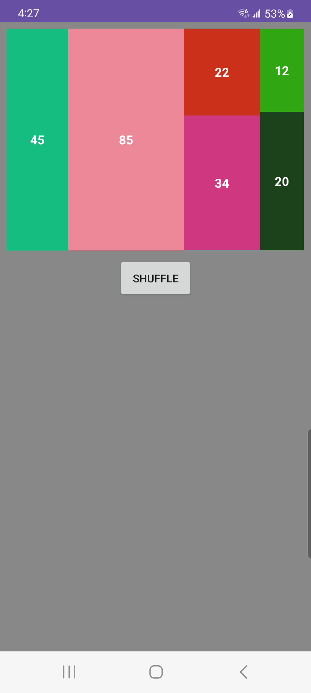

# Bucket View Chart App
Simple android app demonstrates a bucket view chart.

## Implementation

Given a data array `45, 85, 22, 34, 12, 20` it will be bucketed into smaller buckets as such `[[45], [85], [22, 34], [12, 20]]`. 

`BucketView` will render the buckets into a parent FrameLayout. Each bucket will have a `LinearLayout` that renders `TextView` from its bucket. `TextView` will apply weight based on it `value / bucketSum`.

## Preview
